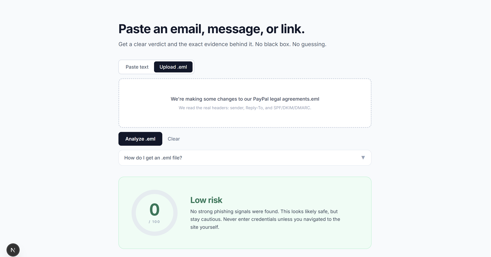
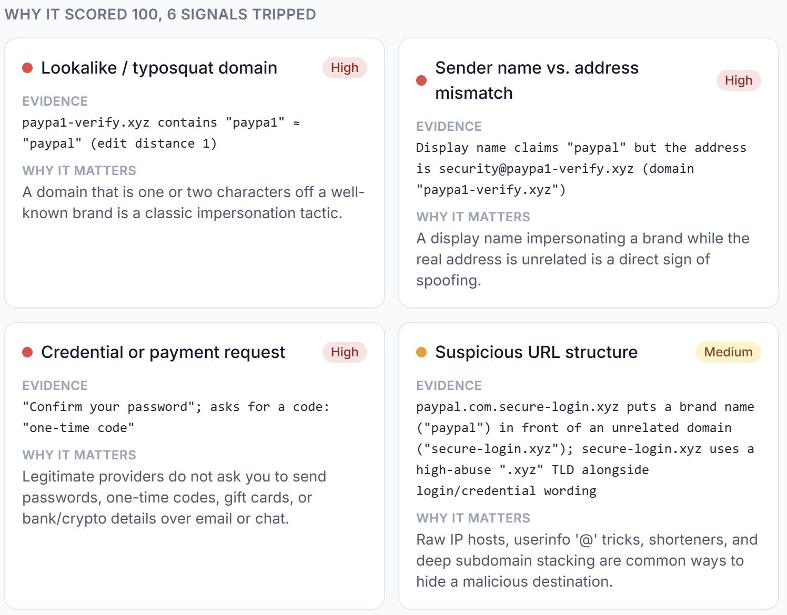
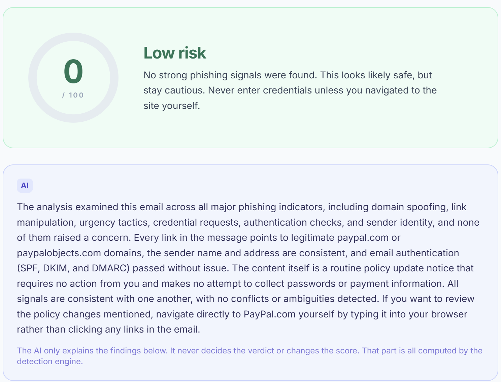

# Explainable Phishing Triage Analyzer

Paste a suspicious email, message, or link and get a plain, evidence-backed verdict, signal by signal, instead of a black-box guess.

The core idea: a deterministic engine decides the verdict; an LLM only explains it. Detection is done by explicit, verifiable rules (so it is reliable and auditable), and the AI layer turns those findings into a clear human explanation. The AI never changes the score.

## What it does

Accepts a pasted email, message, or URL, or an uploaded .eml file (which exposes the real sender headers). It runs a deterministic signal engine and produces a 0 to 100 risk score with a Low, Medium, or High verdict and a recommended action. It can also generate a plain-language explanation of the findings via the Anthropic API. It works fully without a key; the AI layer is never load-bearing.

## Detection signals

Domain and URL: lookalike or typosquatted domains, punycode and homograph tricks, link-text-versus-destination mismatch, raw-IP and userinfo tricks, subdomain stacking, risky TLDs, and URL shorteners.

Domain age: an RDAP lookup flags very newly registered domains, and degrades gracefully if unavailable.

Email authentication (.eml): parses headers and grades SPF, DKIM, and DMARC. A fail is a strong red flag; a pass confirms origin but does not by itself prove safety.

Language: urgency and threat phrasing, credential and payment requests, generic greetings, and sender display-name versus address mismatch.

## How scoring works

Each signal carries a severity weight. Triggered weights sum, capped at 100, into a category. Passed checks are shown too, as a transparency record of what was verified and cleared.

## Tech stack

Next.js (App Router) with TypeScript and Tailwind. Analysis runs server-side, and the Anthropic API key is read from the server environment and never exposed to the client.

## Run locally

Install dependencies and start the dev server:

    npm install
    npm run dev

Open http://localhost:3000. The deterministic engine works with no configuration. To enable the AI explanation layer, add an ANTHROPIC_API_KEY to a .env.local file.

## Disclaimer

An explainable triage and education tool, not a replacement for enterprise email security. Checks report verifiable facts and the AI only explains them; a Low score is not a guarantee of safety.